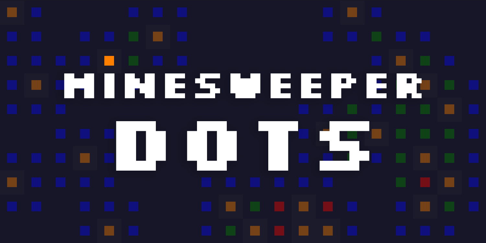
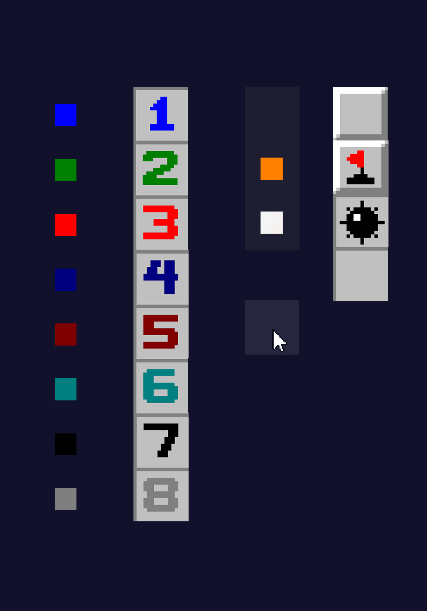

Dots is a sleek, modern implementation of Minesweeper, focused on high-scores and with cross-platform compatability.

## Design
The cells have all been simplified, with squares of different colors replacing icons.

