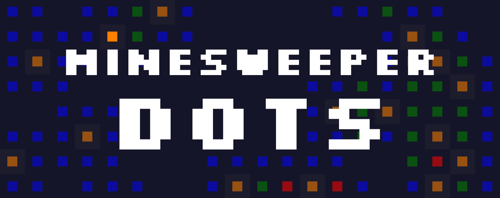

## Dots is a sleek, modern Minesweeper app, focused on statistics and with cross-platform compatability

------

## Features
### :blue_square: Sleek design
### :baby: Easy to use*
### :memo: Configurable
### :triangular_flag_on_post: Millisecond pb and average scores

*\* Provided the user is familiar with Minesweeper and is literate.*

------

## :grey_question: About
The project was born out of a personal "need" for a dedicated Minesweeper client with millisecond scores as well as average scores. During the development I decided
to also spice up (spice down?) the visuals a tad, simplifying things as much as possible. Because of the somewhat abstract representation of numbers, Dots is probably best suited for those who are familiar with the classic Minesweeper and its colors.

### Keybinds
**Mouse1** opens cells, **Mouse2** toggles flags ... and of course there is functionality for the "macro" feature often seen in Minesweeper implementations where the spacebar opens the neighbours of cells with the correct amount of neighbouring flags, this can be used either with **Spacebar** or with **Mouse3**.

The difficulty can be changed with the **Number-keys** (1-3 for beginner, intermediate and expert, respectively) and **Escape** resets the game.

## :art: Design
The cells all have a simplified design, with squares of different colors replacing icons.

<p align="center">

</p>

... and the UI is right where you left it, with flags remaining to the top left and the timer to the top right.

<p align="center">


</p>

<p align="center">

</p>

## :triangular_flag_on_post: Statistics
Statistics are automatically loaded, updated, and saved during the lifetime of the program. The current pb and average score for each difficulty is displayed in the title bar, following the name of the difficulty.

Though the scores are displayed with two decimals of precision, the full float-value of the score is saved and compared against when checking for pb:s.

## :wrench: Custom configuration
Difficulties can be added and modified by changing the [config.json](src/config.json) file which contains data pertinent to each difficulty as well as the default difficulty to be loaded when the program starts.

You could also add your own, custom difficulties by adding a json structure like the existing ones to the difficulty array. These can be accessed by pressing the **Number key** corresponding to the difficulties' index within the array.

The "stats"-property is automatically created when a difficulty is played, but one could include it manually.

### Example:

Adding the following json data to the difficulty array in the config file:
```json
{
    "mines": 5,
    "name": "Custom difficulty",
    "size": [
        15,
        10
    ]
}
```

and pressing the **Number key 4** when in-game would yield this result:

<p align="center">

</p>

## :hammer: Installing
Simply download and extract the latest release at a location of your choosing and you're good to go.

## :hammer: Updating
Generally, in order to update one simply has to download the latest version and replace the config file to keep existing statistics; in some cases, however, 
the structure of the config file might be different between different versions, in which case you'd have to manually transfer the old statistics to the provided,
updated config file.

## :test_tube: Building
The project uses C++17 and [SFML](https://www.sfml-dev.org/) for rendering and user input so you'll have to link against that. Because the program is intended to run on multiple platforms, the lib `sfml-main-s` is used to use `main` as an entry-point, as opposed to `WinMain` on Windows, et c.

## Todo
- [ ] Create a release for Linux
- [ ] Add functionality for a 10th difficulty by utilizing the `0` key for index 9
- [ ] Improve code documentation
- [ ] Make the window size scale depending on monitor resolution, so the window doesn't go out of bounds

## :trophy: Credit
The font used for the project is [Silkscreen](https://kottke.org/plus/type/silkscreen/index.html) and [nlohmann](https://github.com/nlohmann)'s [json library](https://github.com/nlohmann/json) is used for data serialization/deserialization.
